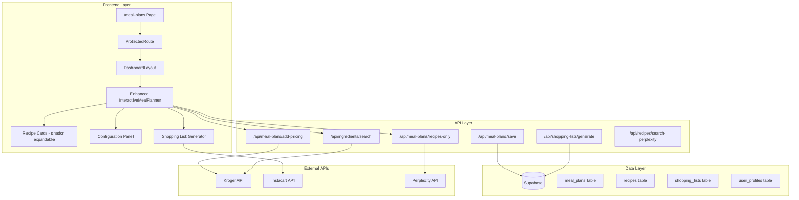
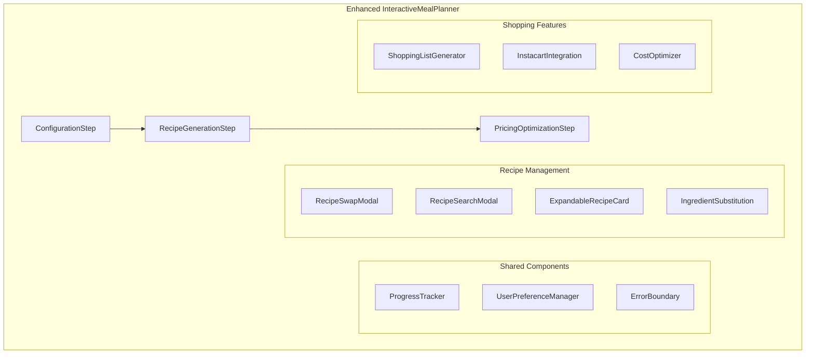

# Interactive Meal Planner Integration Design

## Overview

This design document outlines the technical approach for integrating the proven Interactive Meal Planner (currently at `/test-interactive-planner`) into the main PlateWise meal planning interface at `/meal-plans`. The design ensures full API compatibility, preserves existing UI components, and adds comprehensive new features while maintaining the superior user experience demonstrated in the working test.

## Architecture

### High-Level Architecture



### Component Architecture



## Components and Interfaces

### Core Component Structure

#### 1. Enhanced InteractiveMealPlanner Component

```typescript
interface EnhancedInteractiveMealPlannerProps {
  // Inherits from existing MealPlannerInterface
  user: User;
  initialPreferences?: UserPreferences;
}

interface MealPlannerState {
  step: 'configure' | 'recipes' | 'pricing';
  config: MealPlanConfig;
  recipes: Recipe[];
  savedMealPlan?: SavedMealPlan;
  shoppingList?: ShoppingList;
  loading: boolean;
  error?: string;
}

interface MealPlanConfig {
  culturalCuisines: string[];
  dietaryRestrictions: string[];
  householdSize: number;
  timeFrame: string;
  zipCode: string;
  budgetLimit?: number;
  // User profile integration
  useProfileDefaults: boolean;
  overrides: Partial<UserPreferences>;
}
```

#### 2. Recipe Swap and Search Components

```typescript
interface RecipeSwapModalProps {
  currentRecipe: Recipe;
  mealPlanConfig: MealPlanConfig;
  onSwapRecipe: (newRecipe: Recipe) => void;
  onClose: () => void;
}

interface RecipeSearchModalProps {
  searchQuery?: string;
  culturalFilters: string[];
  dietaryFilters: string[];
  onSelectRecipe: (recipe: Recipe) => void;
  onClose: () => void;
}

// Integration with existing expandable card
interface EnhancedExpandableRecipeCardProps extends ExpandableRecipeCardProps {
  onSwapRecipe: () => void;
  onSaveRecipe: () => void;
  onScaleRecipe: (newServings: number) => void;
  showSwapButton: boolean;
  showSaveButton: boolean;
}
```

#### 3. Shopping List Integration

```typescript
interface ShoppingListGeneratorProps {
  recipes: Recipe[];
  mealPlanId: string;
  onGenerateList: (shoppingList: ShoppingList) => void;
}

interface InstacartIntegrationProps {
  shoppingList: ShoppingList;
  userLocation: string;
  onOrderWithInstacart: (orderDetails: InstacartOrder) => void;
}
```

### Data Models

#### Enhanced Recipe Model

```typescript
interface Recipe {
  id: string;
  title: string;
  description: string;
  culturalOrigin: string[];
  cuisine: string;
  ingredients: EnhancedIngredient[];
  instructions: string[];
  metadata: RecipeMetadata;
  pricing?: RecipePricing;
  imageUrl?: string;
  sourceUrl?: string;
  hasPricing: boolean;
  // New fields for enhanced functionality
  authenticityScore?: number;
  userModifications?: UserModification[];
  savedToCollection?: boolean;
  swappedFrom?: string; // Original recipe ID if swapped
}

interface EnhancedIngredient extends Ingredient {
  // Existing fields preserved
  id: string;
  name: string;
  amount: string;
  unit: string;
  originalName: string;
  isSubstituted: boolean;
  userStatus: 'normal' | 'already-have' | 'specialty-store';
  specialtyStore?: string;
  krogerPrice?: KrogerPricing;
  
  // New fields for enhanced functionality
  packageSize?: string;
  packageQuantity?: number;
  leftoverAmount?: number;
  scalingFactor?: number;
  alternativeOptions?: IngredientAlternative[];
}

interface UserModification {
  type: 'ingredient_substitution' | 'quantity_adjustment' | 'scaling';
  originalValue: any;
  newValue: any;
  reason?: string;
  timestamp: Date;
}
```

#### Meal Plan and Shopping List Models

```typescript
interface SavedMealPlan {
  id: string;
  userId: string;
  name: string;
  description?: string;
  recipes: Recipe[];
  configuration: MealPlanConfig;
  totalCost: number;
  costPerServing: number;
  createdAt: Date;
  updatedAt: Date;
  tags?: string[];
  isPublic?: boolean;
}

interface ShoppingList {
  id: string;
  userId: string;
  mealPlanId: string;
  name: string;
  items: ConsolidatedIngredient[];
  totalCost: number;
  storeBreakdown: StoreBreakdown[];
  instacartOrderId?: string;
  status: 'active' | 'completed' | 'ordered';
  createdAt: Date;
  updatedAt: Date;
}

interface ConsolidatedIngredient {
  name: string;
  totalQuantity: number;
  unit: string;
  recipes: string[]; // Recipe IDs that use this ingredient
  pricing: IngredientPricing;
  packageOptimization: PackageOptimization;
  userStatus: 'normal' | 'already-have' | 'specialty-store';
  specialtyStore?: string;
}

interface PackageOptimization {
  recommendedPackageSize: string;
  packageQuantity: number;
  leftoverAmount: number;
  costPerUnit: number;
  alternatives: PackageAlternative[];
}
```

## Error Handling

### Error Boundary Implementation

```typescript
class MealPlannerErrorBoundary extends React.Component<
  { children: React.ReactNode },
  { hasError: boolean; error?: Error }
> {
  static getDerivedStateFromError(error: Error) {
    return { hasError: true, error };
  }

  componentDidCatch(error: Error, errorInfo: React.ErrorInfo) {
    // Log error to monitoring service
    console.error('Meal Planner Error:', error, errorInfo);
    
    // Preserve user's work in localStorage
    this.preserveUserWork();
  }

  private preserveUserWork() {
    try {
      const currentState = this.getCurrentMealPlannerState();
      localStorage.setItem('mealPlannerBackup', JSON.stringify(currentState));
    } catch (e) {
      console.error('Failed to preserve user work:', e);
    }
  }

  render() {
    if (this.state.hasError) {
      return <MealPlannerErrorFallback error={this.state.error} />;
    }

    return this.props.children;
  }
}
```

### API Error Handling Strategy

```typescript
class APIErrorHandler {
  static async handleAPICall<T>(
    apiCall: () => Promise<T>,
    fallbackData?: T,
    errorContext?: string
  ): Promise<{ data?: T; error?: string; fromFallback?: boolean }> {
    try {
      const data = await apiCall();
      return { data };
    } catch (error) {
      console.error(`API Error in ${errorContext}:`, error);
      
      if (fallbackData) {
        return { data: fallbackData, fromFallback: true };
      }
      
      return { 
        error: error instanceof Error ? error.message : 'Unknown error occurred' 
      };
    }
  }
}
```

## Testing Strategy

### Component Testing Approach

```typescript
// Test suite structure for Enhanced InteractiveMealPlanner
describe('Enhanced InteractiveMealPlanner', () => {
  describe('API Compatibility', () => {
    it('should use identical APIs as test-interactive-planner', async () => {
      // Test that all API calls match the working test
      const mockConfig = createMockMealPlanConfig();
      
      // Mock the exact API responses from test-interactive-planner
      mockAPI('/api/meal-plans/recipes-only', mockRecipesResponse);
      mockAPI('/api/meal-plans/add-pricing', mockPricingResponse);
      mockAPI('/api/ingredients/search', mockSearchResponse);
      
      const { result } = renderHook(() => useMealPlanner(mockConfig));
      
      await act(async () => {
        await result.current.generateRecipes();
      });
      
      expect(result.current.recipes).toEqual(expectedRecipesFromTest);
    });
  });

  describe('User Profile Integration', () => {
    it('should pre-populate from user profile with override capability', () => {
      const mockUser = createMockUserWithPreferences();
      const { getByTestId } = render(
        <EnhancedInteractiveMealPlanner user={mockUser} />
      );
      
      expect(getByTestId('cultural-cuisines')).toHaveValue(mockUser.preferences.culturalCuisines);
      expect(getByTestId('override-indicator')).not.toBeInTheDocument();
      
      // Test override functionality
      fireEvent.change(getByTestId('cultural-cuisines'), { target: { value: ['italian'] } });
      expect(getByTestId('override-indicator')).toBeInTheDocument();
    });
  });

  describe('Recipe Swapping', () => {
    it('should allow swapping recipes from saved collection', async () => {
      const mockMealPlan = createMockMealPlan();
      const mockSavedRecipes = createMockSavedRecipes();
      
      const { getByTestId } = render(
        <EnhancedInteractiveMealPlanner initialMealPlan={mockMealPlan} />
      );
      
      fireEvent.click(getByTestId('swap-recipe-0'));
      fireEvent.click(getByTestId('my-saved-recipes-tab'));
      
      await waitFor(() => {
        expect(getByTestId('saved-recipes-list')).toBeInTheDocument();
      });
      
      fireEvent.click(getByTestId('select-saved-recipe-1'));
      
      expect(mockMealPlan.recipes[0]).toEqual(mockSavedRecipes[1]);
    });
  });

  describe('Accessibility', () => {
    it('should meet WCAG 2.1 AA standards', async () => {
      const { container } = render(<EnhancedInteractiveMealPlanner />);
      const results = await axe(container);
      expect(results).toHaveNoViolations();
    });

    it('should support keyboard navigation', () => {
      const { getByTestId } = render(<EnhancedInteractiveMealPlanner />);
      
      // Test tab navigation through all interactive elements
      const interactiveElements = [
        'cultural-cuisines-select',
        'household-size-input',
        'generate-recipes-button'
      ];
      
      interactiveElements.forEach((elementId, index) => {
        const element = getByTestId(elementId);
        expect(element).toHaveAttribute('tabIndex', index.toString());
      });
    });
  });
});
```

### Integration Testing

```typescript
describe('Meal Planner Integration Tests', () => {
  it('should complete full workflow: configure → recipes → pricing → shopping', async () => {
    const { getByTestId, getByText } = render(
      <ProtectedRoute>
        <DashboardLayout>
          <EnhancedInteractiveMealPlanner />
        </DashboardLayout>
      </ProtectedRoute>
    );

    // Step 1: Configuration
    fireEvent.change(getByTestId('cultural-cuisines'), { target: { value: ['mexican'] } });
    fireEvent.change(getByTestId('household-size'), { target: { value: '4' } });
    fireEvent.click(getByTestId('generate-recipes-button'));

    // Wait for recipes to load
    await waitFor(() => {
      expect(getByText('Your Recipes')).toBeInTheDocument();
    });

    // Step 2: Add pricing
    fireEvent.click(getByTestId('add-pricing-button'));
    
    await waitFor(() => {
      expect(getByTestId('recipe-pricing')).toBeInTheDocument();
    });

    // Step 3: Generate shopping list
    fireEvent.click(getByTestId('generate-shopping-list-button'));
    
    await waitFor(() => {
      expect(getByText('Shopping List Generated')).toBeInTheDocument();
    });

    // Verify shopping list appears on shopping page
    fireEvent.click(getByTestId('view-shopping-list-button'));
    
    await waitFor(() => {
      expect(window.location.pathname).toBe('/shopping');
    });
  });
});
```

## Database Schema Implementation

### Migration Scripts

```sql
-- Migration: Add enhanced meal planning tables
-- File: supabase/migrations/004_enhanced_meal_planning.sql

-- Enhance existing meal_plans table
ALTER TABLE meal_plans ADD COLUMN IF NOT EXISTS cultural_cuisines TEXT[];
ALTER TABLE meal_plans ADD COLUMN IF NOT EXISTS dietary_restrictions TEXT[];
ALTER TABLE meal_plans ADD COLUMN IF NOT EXISTS household_size INTEGER DEFAULT 4;
ALTER TABLE meal_plans ADD COLUMN IF NOT EXISTS zip_code TEXT;
ALTER TABLE meal_plans ADD COLUMN IF NOT EXISTS preferences JSONB DEFAULT '{}';
ALTER TABLE meal_plans ADD COLUMN IF NOT EXISTS is_saved BOOLEAN DEFAULT false;
ALTER TABLE meal_plans ADD COLUMN IF NOT EXISTS tags TEXT[] DEFAULT '{}';

-- Enhance existing recipes table
ALTER TABLE recipes ADD COLUMN IF NOT EXISTS cultural_origin TEXT[];
ALTER TABLE recipes ADD COLUMN IF NOT EXISTS authenticity_score DECIMAL;
ALTER TABLE recipes ADD COLUMN IF NOT EXISTS user_modifications JSONB DEFAULT '[]';
ALTER TABLE recipes ADD COLUMN IF NOT EXISTS saved_to_collection BOOLEAN DEFAULT false;
ALTER TABLE recipes ADD COLUMN IF NOT EXISTS swapped_from UUID REFERENCES recipes(id);

-- Create shopping_lists table
CREATE TABLE IF NOT EXISTS shopping_lists (
  id UUID PRIMARY KEY DEFAULT gen_random_uuid(),
  user_id UUID REFERENCES auth.users(id) ON DELETE CASCADE,
  meal_plan_id UUID REFERENCES meal_plans(id) ON DELETE CASCADE,
  name TEXT NOT NULL,
  items JSONB NOT NULL DEFAULT '[]',
  total_cost DECIMAL DEFAULT 0,
  store_breakdown JSONB DEFAULT '[]',
  instacart_order_id TEXT,
  status TEXT DEFAULT 'active' CHECK (status IN ('active', 'completed', 'ordered')),
  created_at TIMESTAMP WITH TIME ZONE DEFAULT NOW(),
  updated_at TIMESTAMP WITH TIME ZONE DEFAULT NOW()
);

-- Create indexes for performance
CREATE INDEX IF NOT EXISTS idx_meal_plans_user_cultural ON meal_plans(user_id, cultural_cuisines);
CREATE INDEX IF NOT EXISTS idx_recipes_cultural_origin ON recipes(cultural_origin);
CREATE INDEX IF NOT EXISTS idx_shopping_lists_user_status ON shopping_lists(user_id, status);
CREATE INDEX IF NOT EXISTS idx_shopping_lists_meal_plan ON shopping_lists(meal_plan_id);

-- Enable RLS
ALTER TABLE shopping_lists ENABLE ROW LEVEL SECURITY;

-- RLS Policies
CREATE POLICY "Users can view their own shopping lists" ON shopping_lists
  FOR SELECT USING (auth.uid() = user_id);

CREATE POLICY "Users can create their own shopping lists" ON shopping_lists
  FOR INSERT WITH CHECK (auth.uid() = user_id);

CREATE POLICY "Users can update their own shopping lists" ON shopping_lists
  FOR UPDATE USING (auth.uid() = user_id);

CREATE POLICY "Users can delete their own shopping lists" ON shopping_lists
  FOR DELETE USING (auth.uid() = user_id);

-- Create updated_at trigger for shopping_lists
CREATE OR REPLACE FUNCTION update_updated_at_column()
RETURNS TRIGGER AS $$
BEGIN
    NEW.updated_at = NOW();
    RETURN NEW;
END;
$$ language 'plpgsql';

CREATE TRIGGER update_shopping_lists_updated_at 
  BEFORE UPDATE ON shopping_lists 
  FOR EACH ROW EXECUTE FUNCTION update_updated_at_column();
```

### Data Access Layer

```typescript
// Enhanced data access for meal planning
export class MealPlanningService {
  private supabase = createClient();

  async saveMealPlan(mealPlan: Omit<SavedMealPlan, 'id' | 'createdAt' | 'updatedAt'>): Promise<SavedMealPlan> {
    const { data, error } = await this.supabase
      .from('meal_plans')
      .insert({
        user_id: mealPlan.userId,
        name: mealPlan.name,
        description: mealPlan.description,
        cultural_cuisines: mealPlan.configuration.culturalCuisines,
        dietary_restrictions: mealPlan.configuration.dietaryRestrictions,
        household_size: mealPlan.configuration.householdSize,
        zip_code: mealPlan.configuration.zipCode,
        preferences: mealPlan.configuration,
        total_cost: mealPlan.totalCost,
        cost_per_serving: mealPlan.costPerServing,
        is_saved: true,
        tags: mealPlan.tags || []
      })
      .select()
      .single();

    if (error) throw error;

    // Save associated recipes
    await this.saveRecipesForMealPlan(data.id, mealPlan.recipes);

    return this.getMealPlanById(data.id);
  }

  async generateShoppingList(mealPlanId: string, recipes: Recipe[]): Promise<ShoppingList> {
    // Consolidate ingredients across all recipes
    const consolidatedItems = this.consolidateIngredients(recipes);
    
    const { data, error } = await this.supabase
      .from('shopping_lists')
      .insert({
        meal_plan_id: mealPlanId,
        name: `Shopping List - ${new Date().toLocaleDateString()}`,
        items: consolidatedItems,
        total_cost: this.calculateTotalCost(consolidatedItems),
        store_breakdown: this.generateStoreBreakdown(consolidatedItems)
      })
      .select()
      .single();

    if (error) throw error;
    return data;
  }

  private consolidateIngredients(recipes: Recipe[]): ConsolidatedIngredient[] {
    const ingredientMap = new Map<string, ConsolidatedIngredient>();

    recipes.forEach(recipe => {
      recipe.ingredients.forEach(ingredient => {
        const key = ingredient.name.toLowerCase();
        
        if (ingredientMap.has(key)) {
          const existing = ingredientMap.get(key)!;
          existing.totalQuantity += parseFloat(ingredient.amount) || 0;
          existing.recipes.push(recipe.id);
        } else {
          ingredientMap.set(key, {
            name: ingredient.name,
            totalQuantity: parseFloat(ingredient.amount) || 0,
            unit: ingredient.unit,
            recipes: [recipe.id],
            pricing: ingredient.krogerPrice ? {
              unitPrice: ingredient.krogerPrice.unitPrice,
              totalCost: ingredient.krogerPrice.totalCost,
              onSale: ingredient.krogerPrice.onSale,
              salePrice: ingredient.krogerPrice.salePrice
            } : null,
            packageOptimization: this.calculatePackageOptimization(ingredient),
            userStatus: ingredient.userStatus,
            specialtyStore: ingredient.specialtyStore
          });
        }
      });
    });

    return Array.from(ingredientMap.values());
  }
}
```

## Performance Optimization

### Caching Strategy

```typescript
// Enhanced caching for meal planning
export class MealPlannerCache {
  private static readonly CACHE_KEYS = {
    RECIPES: 'meal_planner_recipes',
    PRICING: 'meal_planner_pricing',
    USER_PREFERENCES: 'user_preferences',
    SAVED_RECIPES: 'saved_recipes'
  };

  static async cacheRecipes(config: MealPlanConfig, recipes: Recipe[]): Promise<void> {
    const cacheKey = `${this.CACHE_KEYS.RECIPES}_${this.hashConfig(config)}`;
    const cacheData = {
      recipes,
      timestamp: Date.now(),
      config
    };
    
    localStorage.setItem(cacheKey, JSON.stringify(cacheData));
  }

  static async getCachedRecipes(config: MealPlanConfig): Promise<Recipe[] | null> {
    const cacheKey = `${this.CACHE_KEYS.RECIPES}_${this.hashConfig(config)}`;
    const cached = localStorage.getItem(cacheKey);
    
    if (!cached) return null;
    
    try {
      const { recipes, timestamp } = JSON.parse(cached);
      const isExpired = Date.now() - timestamp > 30 * 60 * 1000; // 30 minutes
      
      return isExpired ? null : recipes;
    } catch {
      return null;
    }
  }

  private static hashConfig(config: MealPlanConfig): string {
    return btoa(JSON.stringify({
      culturalCuisines: config.culturalCuisines.sort(),
      dietaryRestrictions: config.dietaryRestrictions.sort(),
      householdSize: config.householdSize,
      timeFrame: config.timeFrame
    }));
  }
}
```

### Lazy Loading Implementation

```typescript
// Lazy load heavy components
const RecipeSwapModal = lazy(() => import('./RecipeSwapModal'));
const InstacartIntegration = lazy(() => import('./InstacartIntegration'));
const ShoppingListGenerator = lazy(() => import('./ShoppingListGenerator'));

// Use Suspense for loading states
function EnhancedInteractiveMealPlanner() {
  return (
    <ErrorBoundary>
      <div className="meal-planner-container">
        <Suspense fallback={<LoadingSpinner />}>
          {showRecipeSwap && <RecipeSwapModal {...recipeSwapProps} />}
          {showShoppingList && <ShoppingListGenerator {...shoppingProps} />}
          {showInstacart && <InstacartIntegration {...instacartProps} />}
        </Suspense>
      </div>
    </ErrorBoundary>
  );
}
```

This design ensures a seamless integration of the proven Interactive Meal Planner functionality into the main PlateWise interface while adding comprehensive new features and maintaining excellent performance and accessibility standards.