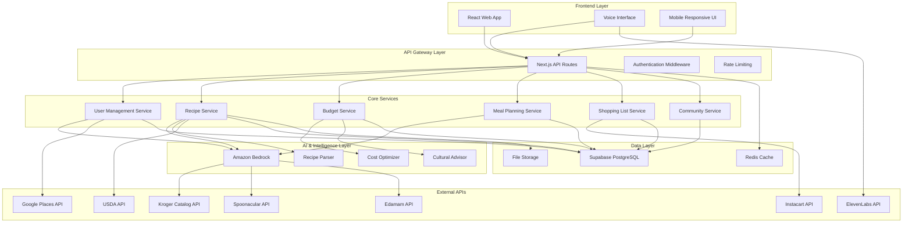

# PlateWise Design Document

## Overview

PlateWise is a comprehensive, AI-driven web application that helps families and individuals optimize their food budgets while preserving cultural culinary traditions. The platform combines advanced cost analysis, cultural heritage preservation, nutritional optimization, and community features to create a holistic meal planning and grocery shopping experience.

### Core Value Proposition
- **Budget Optimization**: Real-time price comparison, cost analysis, and intelligent spending recommendations
- **Cultural Preservation**: Authentic recipe adaptation, traditional technique guides, and cultural ingredient education
- **AI Intelligence**: Amazon Bedrock-powered meal planning, recipe recommendations, and ingredient substitutions
- **Community Connection**: Social recipe sharing, local sourcing recommendations, and cultural food traditions

## Architecture

### High-Level Architecture



### Technology Stack

**Frontend:**
- **Framework**: Next.js 14 with React 18
- **Styling**: Tailwind CSS with custom cultural themes and bento-style grid layouts
- **Design System**: Bento-style card layouts with bold, culturally-inspired color palettes
- **State Management**: Zustand for client state, React Query for server state
- **Voice Interface**: Web Speech API + ElevenLabs integration
- **Internationalization**: next-i18next for multi-language support
- **Accessibility**: Radix UI components for WCAG 2.1 AA compliance

**Backend:**
- **Runtime**: Node.js with Next.js API routes
- **Database**: Supabase (PostgreSQL) with Row Level Security
- **Authentication**: Supabase Auth with OAuth providers
- **Caching**: Redis for API responses and user sessions
- **File Storage**: Supabase Storage for recipe images and user uploads

**AI & Intelligence:**
- **Primary AI**: Perplexity AI API
- **Voice Processing**: ElevenLabs for text-to-speech and voice synthesis
- **Recipe Parsing**: Custom NLP pipeline using Bedrock
- **Cost Optimization**: Machine learning models for price prediction

**External Integrations:**
- **Grocery Data**: Kroger Catalog API for pricing and availability
- **Recipe Database**: Spoonacular API for comprehensive recipe data
- **Nutrition Analysis**: Edamam API for detailed nutritional information
- **Location Services**: Google Places API for store discovery
- **Farmer Markets**: USDA API for local market data
- **Delivery**: Instacart API for optional grocery delivery

## Components and Interfaces

### Core Components

#### 1. User Profile System
```typescript
interface UserProfile {
  id: string;
  email: string;
  name: string;
  location: {
    zipCode: string;
    city: string;
    state: string;
  };
  preferences: {
    languages: string[];
    primaryLanguage: string;
    culturalCuisines: string[];
    dietaryRestrictions: string[];
    allergies: string[];
    dislikes: string[];
  };
  budget: {
    monthlyLimit: number;
    householdSize: number;
    shoppingFrequency: 'weekly' | 'biweekly' | 'monthly';
  };
  nutritionalGoals: {
    calorieTarget: number;
    macroTargets: {
      protein: number;
      carbs: number;
      fat: number;
    };
    healthGoals: string[];
    activityLevel: string;
  };
  cookingProfile: {
    skillLevel: 'beginner' | 'intermediate' | 'advanced';
    availableTime: number;
    equipment: string[];
    mealPrepPreference: boolean;
  };
  savedStores: SavedStore[];
  createdAt: Date;
  updatedAt: Date;
}
```

#### 2. Recipe Management System
```typescript
interface Recipe {
  id: string;
  title: string;
  description: string;
  culturalOrigin: string[];
  cuisine: string;
  ingredients: Ingredient[];
  instructions: Instruction[];
  nutritionalInfo: NutritionalInfo;
  costAnalysis: CostAnalysis;
  metadata: {
    servings: number;
    prepTime: number;
    cookTime: number;
    totalTime: number;
    difficulty: 'easy' | 'medium' | 'hard';
    culturalAuthenticity: number; // 1-10 scale
  };
  tags: string[];
  source: 'user' | 'spoonacular' | 'community';
  authorId?: string;
  ratings: Rating[];
  reviews: Review[];
  createdAt: Date;
  updatedAt: Date;
}

interface Ingredient {
  id: string;
  name: string;
  amount: number;
  unit: string;
  culturalName?: string;
  substitutes: IngredientSubstitute[];
  costPerUnit: number;
  availability: StoreAvailability[];
  culturalSignificance?: string;
}
```

#### 3. Budget Management System
```typescript
interface BudgetTracker {
  id: string;
  userId: string;
  period: 'weekly' | 'monthly';
  startDate: Date;
  endDate: Date;
  budgetLimit: number;
  currentSpending: number;
  categories: {
    produce: number;
    meat: number;
    dairy: number;
    pantry: number;
    specialty: number;
  };
  transactions: Transaction[];
  alerts: BudgetAlert[];
  projectedSpending: number;
  savingsAchieved: number;
}

interface CostOptimization {
  totalCost: number;
  costPerServing: number;
  storeComparison: StorePrice[];
  seasonalTrends: PriceTrend[];
  bulkBuyingOpportunities: BulkOpportunity[];
  couponSavings: CouponSaving[];
  alternativeIngredients: CostAlternative[];
}
```

#### 4. Meal Planning Engine
```typescript
interface MealPlan {
  id: string;
  userId: string;
  name: string;
  startDate: Date;
  endDate: Date;
  meals: PlannedMeal[];
  totalCost: number;
  nutritionalSummary: NutritionalSummary;
  culturalBalance: CulturalBalance;
  shoppingList: ShoppingList;
  leftoverPlan: LeftoverUtilization[];
  generatedBy: 'ai' | 'user';
  preferences: MealPlanPreferences;
}

interface PlannedMeal {
  date: Date;
  mealType: 'breakfast' | 'lunch' | 'dinner' | 'snack';
  recipeId: string;
  servings: number;
  scaledIngredients: Ingredient[];
  estimatedCost: number;
  culturalContext?: string;
}
```

#### 5. Shopping List System
```typescript
interface ShoppingList {
  id: string;
  userId: string;
  mealPlanId?: string;
  items: ShoppingItem[];
  totalEstimatedCost: number;
  storeRecommendations: StoreRecommendation[];
  couponsAvailable: Coupon[];
  generatedAt: Date;
  completedAt?: Date;
  actualCost?: number;
}

interface ShoppingItem {
  ingredientId: string;
  name: string;
  quantity: number;
  unit: string;
  category: string;
  estimatedPrice: number;
  storeAvailability: StoreAvailability[];
  isChecked: boolean;
  actualPrice?: number;
  notes?: string;
  culturalAlternatives?: string[];
}
```

### AI Integration Interfaces

#### 1. Amazon Bedrock Integration
```typescript
interface BedrockService {
  generateMealPlan(params: MealPlanRequest): Promise<MealPlan>;
  parseRecipe(input: string, language: string): Promise<Recipe>;
  suggestSubstitutions(ingredient: string, cultural: string[]): Promise<Substitution[]>;
  optimizeBudget(constraints: BudgetConstraints): Promise<BudgetOptimization>;
  translateContent(content: string, targetLanguage: string): Promise<string>;
  analyzeCulturalAuthenticity(recipe: Recipe): Promise<CulturalAnalysis>;
  generateShoppingOptimization(list: ShoppingList): Promise<OptimizationSuggestions>;
}

interface MealPlanRequest {
  userId: string;
  budgetConstraints: BudgetConstraints;
  nutritionalGoals: NutritionalGoals;
  culturalPreferences: string[];
  timeframe: DateRange;
  householdSize: number;
  dietaryRestrictions: string[];
  cookingConstraints: CookingConstraints;
}
```

#### 2. Voice Interface System
```typescript
interface VoiceService {
  processVoiceCommand(audio: Blob, language: string): Promise<VoiceCommand>;
  synthesizeSpeech(text: string, language: string): Promise<AudioBuffer>;
  transcribeRecipe(audio: Blob, language: string): Promise<Recipe>;
  provideVoiceNavigation(command: string): Promise<NavigationAction>;
}

interface VoiceCommand {
  intent: 'search' | 'add_recipe' | 'create_meal_plan' | 'navigate' | 'help';
  parameters: Record<string, any>;
  confidence: number;
  language: string;
}
```

### External API Interfaces

#### 1. Kroger Catalog API Integration
```typescript
interface KrogerService {
  searchProducts(query: string, location: string): Promise<Product[]>;
  getProductPricing(productId: string, storeId: string): Promise<ProductPrice>;
  getCoupons(location: string): Promise<Coupon[]>;
  getStoreLocations(zipCode: string): Promise<Store[]>;
  getProductAvailability(productId: string, storeId: string): Promise<Availability>;
}
```

#### 2. Spoonacular API Integration
```typescript
interface SpoonacularService {
  searchRecipes(params: RecipeSearchParams): Promise<Recipe[]>;
  getRecipeDetails(recipeId: string): Promise<Recipe>;
  analyzeNutrition(ingredients: string[]): Promise<NutritionalInfo>;
  findSimilarRecipes(recipeId: string): Promise<Recipe[]>;
  searchByCuisine(cuisine: string, filters: SearchFilters): Promise<Recipe[]>;
}
```

## Data Models

### Database Schema (Supabase PostgreSQL)

```sql
-- Users and Authentication (handled by Supabase Auth)
CREATE TABLE user_profiles (
  id UUID PRIMARY KEY REFERENCES auth.users(id),
  email TEXT NOT NULL,
  name TEXT NOT NULL,
  location JSONB NOT NULL,
  preferences JSONB NOT NULL,
  budget_settings JSONB NOT NULL,
  nutritional_goals JSONB NOT NULL,
  cooking_profile JSONB NOT NULL,
  created_at TIMESTAMP WITH TIME ZONE DEFAULT NOW(),
  updated_at TIMESTAMP WITH TIME ZONE DEFAULT NOW()
);

-- Recipes
CREATE TABLE recipes (
  id UUID PRIMARY KEY DEFAULT gen_random_uuid(),
  title TEXT NOT NULL,
  description TEXT,
  cultural_origin TEXT[] NOT NULL,
  cuisine TEXT NOT NULL,
  ingredients JSONB NOT NULL,
  instructions JSONB NOT NULL,
  nutritional_info JSONB,
  cost_analysis JSONB,
  metadata JSONB NOT NULL,
  tags TEXT[],
  source TEXT NOT NULL CHECK (source IN ('user', 'spoonacular', 'community')),
  author_id UUID REFERENCES user_profiles(id),
  is_public BOOLEAN DEFAULT false,
  created_at TIMESTAMP WITH TIME ZONE DEFAULT NOW(),
  updated_at TIMESTAMP WITH TIME ZONE DEFAULT NOW()
);

-- Recipe Ratings and Reviews
CREATE TABLE recipe_ratings (
  id UUID PRIMARY KEY DEFAULT gen_random_uuid(),
  recipe_id UUID REFERENCES recipes(id) ON DELETE CASCADE,
  user_id UUID REFERENCES user_profiles(id) ON DELETE CASCADE,
  rating INTEGER CHECK (rating >= 1 AND rating <= 5),
  review TEXT,
  cost_rating INTEGER CHECK (cost_rating >= 1 AND cost_rating <= 5),
  authenticity_rating INTEGER CHECK (authenticity_rating >= 1 AND authenticity_rating <= 5),
  created_at TIMESTAMP WITH TIME ZONE DEFAULT NOW(),
  UNIQUE(recipe_id, user_id)
);

-- User Recipe Collections
CREATE TABLE recipe_collections (
  id UUID PRIMARY KEY DEFAULT gen_random_uuid(),
  user_id UUID REFERENCES user_profiles(id) ON DELETE CASCADE,
  name TEXT NOT NULL,
  description TEXT,
  recipe_ids UUID[],
  is_public BOOLEAN DEFAULT false,
  created_at TIMESTAMP WITH TIME ZONE DEFAULT NOW(),
  updated_at TIMESTAMP WITH TIME ZONE DEFAULT NOW()
);

-- Meal Plans
CREATE TABLE meal_plans (
  id UUID PRIMARY KEY DEFAULT gen_random_uuid(),
  user_id UUID REFERENCES user_profiles(id) ON DELETE CASCADE,
  name TEXT NOT NULL,
  start_date DATE NOT NULL,
  end_date DATE NOT NULL,
  meals JSONB NOT NULL,
  total_cost DECIMAL(10,2),
  nutritional_summary JSONB,
  cultural_balance JSONB,
  generated_by TEXT CHECK (generated_by IN ('ai', 'user')),
  preferences JSONB,
  created_at TIMESTAMP WITH TIME ZONE DEFAULT NOW(),
  updated_at TIMESTAMP WITH TIME ZONE DEFAULT NOW()
);

-- Shopping Lists
CREATE TABLE shopping_lists (
  id UUID PRIMARY KEY DEFAULT gen_random_uuid(),
  user_id UUID REFERENCES user_profiles(id) ON DELETE CASCADE,
  meal_plan_id UUID REFERENCES meal_plans(id) ON DELETE SET NULL,
  name TEXT NOT NULL,
  items JSONB NOT NULL,
  total_estimated_cost DECIMAL(10,2),
  actual_cost DECIMAL(10,2),
  store_recommendations JSONB,
  coupons_available JSONB,
  completed_at TIMESTAMP WITH TIME ZONE,
  created_at TIMESTAMP WITH TIME ZONE DEFAULT NOW(),
  updated_at TIMESTAMP WITH TIME ZONE DEFAULT NOW()
);

-- Budget Tracking
CREATE TABLE budget_periods (
  id UUID PRIMARY KEY DEFAULT gen_random_uuid(),
  user_id UUID REFERENCES user_profiles(id) ON DELETE CASCADE,
  period_type TEXT CHECK (period_type IN ('weekly', 'monthly')),
  start_date DATE NOT NULL,
  end_date DATE NOT NULL,
  budget_limit DECIMAL(10,2) NOT NULL,
  current_spending DECIMAL(10,2) DEFAULT 0,
  categories JSONB,
  alerts JSONB,
  projected_spending DECIMAL(10,2),
  savings_achieved DECIMAL(10,2) DEFAULT 0,
  created_at TIMESTAMP WITH TIME ZONE DEFAULT NOW(),
  updated_at TIMESTAMP WITH TIME ZONE DEFAULT NOW()
);

-- Transactions
CREATE TABLE transactions (
  id UUID PRIMARY KEY DEFAULT gen_random_uuid(),
  user_id UUID REFERENCES user_profiles(id) ON DELETE CASCADE,
  budget_period_id UUID REFERENCES budget_periods(id) ON DELETE CASCADE,
  shopping_list_id UUID REFERENCES shopping_lists(id) ON DELETE SET NULL,
  store_name TEXT,
  store_id TEXT,
  amount DECIMAL(10,2) NOT NULL,
  items JSONB,
  transaction_date TIMESTAMP WITH TIME ZONE NOT NULL,
  created_at TIMESTAMP WITH TIME ZONE DEFAULT NOW()
);

-- Saved Stores
CREATE TABLE saved_stores (
  id UUID PRIMARY KEY DEFAULT gen_random_uuid(),
  user_id UUID REFERENCES user_profiles(id) ON DELETE CASCADE,
  store_name TEXT NOT NULL,
  store_type TEXT NOT NULL,
  address TEXT NOT NULL,
  google_place_id TEXT,
  specialties TEXT[],
  notes TEXT,
  rating INTEGER CHECK (rating >= 1 AND rating <= 5),
  is_favorite BOOLEAN DEFAULT false,
  created_at TIMESTAMP WITH TIME ZONE DEFAULT NOW(),
  updated_at TIMESTAMP WITH TIME ZONE DEFAULT NOW()
);

-- Community Features
CREATE TABLE user_follows (
  id UUID PRIMARY KEY DEFAULT gen_random_uuid(),
  follower_id UUID REFERENCES user_profiles(id) ON DELETE CASCADE,
  following_id UUID REFERENCES user_profiles(id) ON DELETE CASCADE,
  created_at TIMESTAMP WITH TIME ZONE DEFAULT NOW(),
  UNIQUE(follower_id, following_id)
);

-- Price History for Analytics
CREATE TABLE price_history (
  id UUID PRIMARY KEY DEFAULT gen_random_uuid(),
  ingredient_name TEXT NOT NULL,
  store_id TEXT NOT NULL,
  price DECIMAL(10,2) NOT NULL,
  unit TEXT NOT NULL,
  recorded_at TIMESTAMP WITH TIME ZONE DEFAULT NOW()
);

-- Row Level Security Policies
ALTER TABLE user_profiles ENABLE ROW LEVEL SECURITY;
ALTER TABLE recipes ENABLE ROW LEVEL SECURITY;
ALTER TABLE recipe_ratings ENABLE ROW LEVEL SECURITY;
ALTER TABLE recipe_collections ENABLE ROW LEVEL SECURITY;
ALTER TABLE meal_plans ENABLE ROW LEVEL SECURITY;
ALTER TABLE shopping_lists ENABLE ROW LEVEL SECURITY;
ALTER TABLE budget_periods ENABLE ROW LEVEL SECURITY;
ALTER TABLE transactions ENABLE ROW LEVEL SECURITY;
ALTER TABLE saved_stores ENABLE ROW LEVEL SECURITY;
ALTER TABLE user_follows ENABLE ROW LEVEL SECURITY;

-- Example RLS Policy
CREATE POLICY "Users can only access their own data" ON user_profiles
  FOR ALL USING (auth.uid() = id);
```

### Caching Strategy (Redis)

```typescript
interface CacheKeys {
  // User session and preferences
  USER_PROFILE: `user:${userId}:profile`;
  USER_PREFERENCES: `user:${userId}:preferences`;
  
  // Recipe and meal planning cache
  RECIPE_DETAILS: `recipe:${recipeId}`;
  MEAL_PLAN: `user:${userId}:meal_plan:${planId}`;
  RECIPE_SEARCH: `search:recipes:${hashOfSearchParams}`;
  
  // Pricing and store data
  STORE_PRICES: `store:${storeId}:prices`;
  INGREDIENT_PRICES: `ingredient:${ingredientName}:prices`;
  COUPONS: `store:${storeId}:coupons`;
  
  // AI-generated content
  AI_MEAL_SUGGESTIONS: `user:${userId}:ai_suggestions:${date}`;
  RECIPE_SUBSTITUTIONS: `recipe:${recipeId}:substitutions`;
  
  // Location-based data
  NEARBY_STORES: `location:${zipCode}:stores`;
  FARMER_MARKETS: `location:${zipCode}:markets`;
}

interface CacheTTL {
  USER_DATA: 3600; // 1 hour
  RECIPE_DATA: 86400; // 24 hours
  PRICING_DATA: 1800; // 30 minutes
  AI_SUGGESTIONS: 7200; // 2 hours
  LOCATION_DATA: 43200; // 12 hours
}
```

## Error Handling

### Error Types and Handling Strategy

```typescript
enum ErrorType {
  VALIDATION_ERROR = 'VALIDATION_ERROR',
  AUTHENTICATION_ERROR = 'AUTHENTICATION_ERROR',
  AUTHORIZATION_ERROR = 'AUTHORIZATION_ERROR',
  EXTERNAL_API_ERROR = 'EXTERNAL_API_ERROR',
  DATABASE_ERROR = 'DATABASE_ERROR',
  AI_SERVICE_ERROR = 'AI_SERVICE_ERROR',
  RATE_LIMIT_ERROR = 'RATE_LIMIT_ERROR',
  NETWORK_ERROR = 'NETWORK_ERROR'
}

interface AppError {
  type: ErrorType;
  message: string;
  code: string;
  details?: any;
  timestamp: Date;
  userId?: string;
  requestId: string;
}

class ErrorHandler {
  static handle(error: AppError): ErrorResponse {
    // Log error for monitoring
    console.error(`[${error.type}] ${error.message}`, error);
    
    // Return user-friendly error response
    switch (error.type) {
      case ErrorType.EXTERNAL_API_ERROR:
        return {
          message: 'Service temporarily unavailable. Using cached data.',
          fallback: true
        };
      case ErrorType.AI_SERVICE_ERROR:
        return {
          message: 'AI features temporarily unavailable. Basic functionality continues.',
          fallback: true
        };
      default:
        return {
          message: 'An error occurred. Please try again.',
          fallback: false
        };
    }
  }
}
```

### Graceful Degradation Strategy

1. **API Failures**: Use cached data when external APIs are unavailable
2. **AI Service Failures**: Fall back to rule-based recommendations
3. **Database Issues**: Implement read replicas and connection pooling
4. **Network Issues**: Offline-first approach with service workers
5. **Authentication Issues**: Clear error messages and recovery options

## Testing Strategy

### Testing Pyramid

```typescript
// Unit Tests (70%)
describe('Recipe Cost Calculator', () => {
  it('should calculate accurate cost per serving', () => {
    const recipe = createMockRecipe();
    const cost = calculateCostPerServing(recipe);
    expect(cost).toBe(expectedCost);
  });
});

// Integration Tests (20%)
describe('Meal Plan Generation', () => {
  it('should generate culturally appropriate meal plans within budget', async () => {
    const userProfile = createMockUserProfile();
    const mealPlan = await generateMealPlan(userProfile);
    expect(mealPlan.totalCost).toBeLessThanOrEqual(userProfile.budget.monthlyLimit);
    expect(mealPlan.culturalBalance.authenticity).toBeGreaterThan(0.8);
  });
});

// End-to-End Tests (10%)
describe('Complete User Journey', () => {
  it('should allow user to create profile, generate meal plan, and create shopping list', async () => {
    await page.goto('/signup');
    await completeProfileSetup();
    await generateMealPlan();
    await createShoppingList();
    expect(await page.textContent('.shopping-list')).toContain('Total Cost');
  });
});
```

### Testing Tools
- **Unit Testing**: Jest + React Testing Library
- **Integration Testing**: Supertest for API testing
- **E2E Testing**: Playwright for cross-browser testing
- **Performance Testing**: Lighthouse CI for performance monitoring
- **Accessibility Testing**: axe-core for WCAG compliance
- **Load Testing**: Artillery for API load testing

### Cultural Content Testing
- **Recipe Authenticity**: Cultural expert review process
- **Translation Quality**: Native speaker validation
- **Cultural Sensitivity**: Community feedback integration
- **Ingredient Accuracy**: Culinary professional verification

## UI/UX Design System

### Bento-Style Layout Architecture

PlateWise employs a modern bento-style design system that organizes content into visually distinct, modular cards that can be arranged in flexible grid layouts. This approach provides:

- **Visual Hierarchy**: Important information is emphasized through card sizing and positioning
- **Cultural Expression**: Bold colors and patterns that reflect diverse culinary traditions
- **Responsive Flexibility**: Cards adapt and reflow across different screen sizes
- **Information Density**: Efficient use of space while maintaining readability

### Color Palette Strategy

#### Primary Cultural Color Themes
```css
/* Mediterranean Theme */
--mediterranean-primary: #E67E22; /* Warm orange */
--mediterranean-secondary: #27AE60; /* Olive green */
--mediterranean-accent: #3498DB; /* Mediterranean blue */

/* Asian Fusion Theme */
--asian-primary: #E74C3C; /* Bold red */
--asian-secondary: #F39C12; /* Golden yellow */
--asian-accent: #8E44AD; /* Deep purple */

/* Latin American Theme */
--latin-primary: #FF6B6B; /* Vibrant coral */
--latin-secondary: #4ECDC4; /* Turquoise */
--latin-accent: #45B7D1; /* Bright blue */

/* African Heritage Theme */
--african-primary: #D35400; /* Burnt orange */
--african-secondary: #27AE60; /* Forest green */
--african-accent: #F1C40F; /* Sunny yellow */

/* Middle Eastern Theme */
--middle-eastern-primary: #8E44AD; /* Royal purple */
--middle-eastern-secondary: #E67E22; /* Spice orange */
--middle-eastern-accent: #16A085; /* Teal */
```

#### Neutral Foundation
```css
/* Base Colors */
--background: #FAFAFA; /* Light gray background */
--surface: #FFFFFF; /* Card backgrounds */
--text-primary: #2C3E50; /* Dark blue-gray */
--text-secondary: #7F8C8D; /* Medium gray */
--border: #ECF0F1; /* Light border */
--shadow: rgba(0, 0, 0, 0.1); /* Subtle shadows */
```

### Bento Card Components

#### 1. Dashboard Layout
```typescript
interface BentoCard {
  id: string;
  type: 'budget' | 'meal-plan' | 'recipe' | 'shopping' | 'community';
  size: 'small' | 'medium' | 'large' | 'wide' | 'tall';
  priority: number;
  culturalTheme?: string;
  content: CardContent;
}

// Example Dashboard Grid
const dashboardLayout = [
  { type: 'budget', size: 'large', position: 'top-left' },
  { type: 'meal-plan', size: 'wide', position: 'top-center' },
  { type: 'recipe', size: 'medium', position: 'top-right' },
  { type: 'shopping', size: 'tall', position: 'middle-left' },
  { type: 'community', size: 'medium', position: 'middle-right' }
];
```

#### 2. Recipe Card Design
```css
.recipe-card {
  @apply rounded-2xl overflow-hidden shadow-lg transition-all duration-300;
  @apply hover:shadow-xl hover:scale-105;
  background: linear-gradient(135deg, var(--cultural-primary), var(--cultural-secondary));
}

.recipe-card-content {
  @apply p-6 bg-white bg-opacity-95 backdrop-blur-sm;
}

.recipe-card-image {
  @apply aspect-video object-cover;
  filter: brightness(1.1) contrast(1.1);
}
```

#### 3. Budget Visualization Cards
```css
.budget-card {
  @apply bg-gradient-to-br from-green-400 to-blue-500;
  @apply text-white rounded-2xl p-6 shadow-lg;
}

.spending-progress {
  @apply h-4 bg-white bg-opacity-30 rounded-full overflow-hidden;
}

.progress-bar {
  @apply h-full bg-white rounded-full transition-all duration-500;
  background: linear-gradient(90deg, #4ADE80, #F59E0B, #EF4444);
}
```

### Cultural Visual Elements

#### 1. Pattern Integration
- **Geometric Patterns**: Subtle background patterns inspired by cultural textiles
- **Food Illustrations**: Hand-drawn style illustrations of cultural ingredients
- **Typography**: Font pairings that respect cultural aesthetics while maintaining readability

#### 2. Cultural Color Adaptation
```typescript
interface CulturalTheme {
  name: string;
  colors: {
    primary: string;
    secondary: string;
    accent: string;
    gradient: string[];
  };
  patterns: {
    background: string;
    accent: string;
  };
  typography: {
    heading: string;
    body: string;
  };
}

const culturalThemes: CulturalTheme[] = [
  {
    name: 'mediterranean',
    colors: {
      primary: '#E67E22',
      secondary: '#27AE60',
      accent: '#3498DB',
      gradient: ['#E67E22', '#F39C12', '#27AE60']
    },
    patterns: {
      background: 'olive-branch-pattern',
      accent: 'geometric-tiles'
    },
    typography: {
      heading: 'Playfair Display',
      body: 'Source Sans Pro'
    }
  }
  // Additional themes...
];
```

### Responsive Bento Grid System

#### 1. Breakpoint Strategy
```css
/* Mobile First Approach */
.bento-grid {
  @apply grid gap-4 p-4;
  grid-template-columns: 1fr;
}

/* Tablet */
@media (min-width: 768px) {
  .bento-grid {
    @apply gap-6 p-6;
    grid-template-columns: repeat(2, 1fr);
  }
}

/* Desktop */
@media (min-width: 1024px) {
  .bento-grid {
    @apply gap-8 p-8;
    grid-template-columns: repeat(4, 1fr);
  }
}

/* Large Desktop */
@media (min-width: 1280px) {
  .bento-grid {
    grid-template-columns: repeat(6, 1fr);
  }
}
```

#### 2. Dynamic Card Sizing
```typescript
const cardSizes = {
  small: 'col-span-1 row-span-1',
  medium: 'col-span-2 row-span-1',
  large: 'col-span-2 row-span-2',
  wide: 'col-span-3 row-span-1',
  tall: 'col-span-1 row-span-2',
  hero: 'col-span-4 row-span-2'
};
```

### Animation and Interaction Design

#### 1. Micro-interactions
```css
.bento-card {
  @apply transition-all duration-300 ease-out;
}

.bento-card:hover {
  @apply transform scale-105 shadow-2xl;
  filter: brightness(1.05);
}

.card-content {
  @apply transition-opacity duration-200;
}

.card-loading {
  @apply animate-pulse bg-gradient-to-r from-gray-200 via-gray-300 to-gray-200;
  background-size: 200% 100%;
  animation: shimmer 1.5s infinite;
}

@keyframes shimmer {
  0% { background-position: -200% 0; }
  100% { background-position: 200% 0; }
}
```

#### 2. Cultural Celebration Animations
```css
/* Festival Mode Animations */
.festival-mode .bento-card {
  animation: celebrate 2s ease-in-out infinite alternate;
}

@keyframes celebrate {
  0% { box-shadow: 0 0 20px var(--cultural-primary); }
  100% { box-shadow: 0 0 40px var(--cultural-accent); }
}
```

### Brand Assets and Logo Integration

#### Logo Usage Guidelines
```typescript
interface LogoVariants {
  primary: {
    path: '/assets/logo/platewise-logo-primary.svg';
    usage: 'Main navigation, headers, primary branding';
    minSize: '120px width';
  };
  compact: {
    path: '/assets/logo/platewise-logo-compact.svg';
    usage: 'Mobile navigation, small spaces, favicons';
    minSize: '32px width';
  };
  monochrome: {
    path: '/assets/logo/platewise-logo-mono.svg';
    usage: 'Single color applications, watermarks';
    colors: ['white', 'black', 'cultural-primary'];
  };
  wordmark: {
    path: '/assets/logo/platewise-wordmark.svg';
    usage: 'Text-heavy layouts, footer, documentation';
    minSize: '100px width';
  };
}
```

#### Logo Placement Strategy
- **Header Navigation**: Primary logo with cultural theme color adaptation
- **Mobile Header**: Compact logo variant for space efficiency
- **Loading Screens**: Animated logo with cultural color transitions
- **Recipe Cards**: Subtle watermark placement for user-generated content
- **Social Sharing**: Logo overlay on shared recipe images
- **Email Templates**: Wordmark in email headers and footers

#### Brand Color Integration
```css
.logo-cultural-adaptation {
  /* Logo adapts to user's selected cultural theme */
  filter: hue-rotate(var(--cultural-hue-shift));
}

.logo-festival-mode {
  /* Special animations during cultural festivals */
  animation: cultural-glow 3s ease-in-out infinite;
}

@keyframes cultural-glow {
  0%, 100% { filter: drop-shadow(0 0 5px var(--cultural-primary)); }
  50% { filter: drop-shadow(0 0 15px var(--cultural-accent)); }
}
```

#### Asset Organization
```
/public/assets/
├── logo/
│   ├── platewise-logo-primary.svg
│   ├── platewise-logo-compact.svg
│   ├── platewise-logo-mono.svg
│   ├── platewise-wordmark.svg
│   └── favicon/
│       ├── favicon.ico
│       ├── apple-touch-icon.png
│       └── android-chrome-192x192.png
├── patterns/
│   ├── cultural-backgrounds/
│   └── decorative-elements/
└── illustrations/
    ├── food-icons/
    └── cultural-elements/
```

This comprehensive design provides a solid foundation for building PlateWise as a culturally-aware, budget-optimized meal planning platform with advanced AI capabilities, robust community features, and a visually stunning bento-style interface that celebrates cultural diversity through bold, vibrant design.