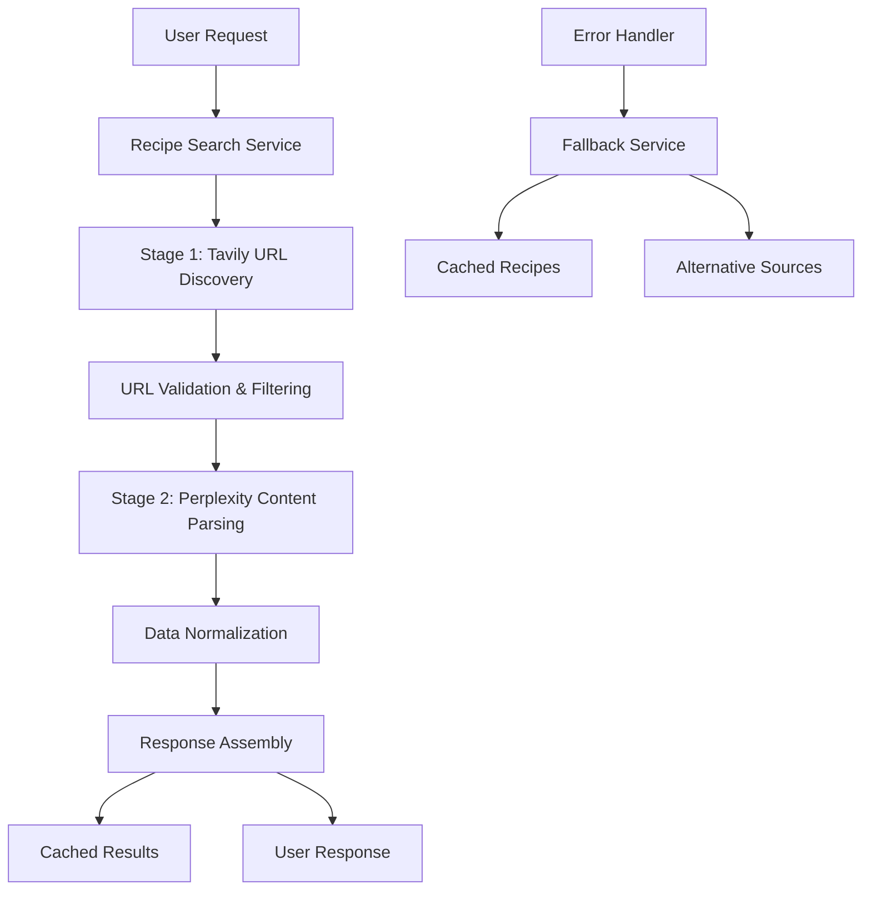

# Design Document

## Overview

The Tavily + Perplexity Recipe Search system implements a two-stage hybrid approach that combines Tavily's AI-optimized search capabilities with Perplexity's excellent content parsing. This design leverages each service's strengths: Tavily for finding accurate, working recipe URLs and Perplexity for extracting structured recipe data with cultural context.

**CRITICAL COMPATIBILITY REQUIREMENT**: This implementation MUST maintain 100% backward compatibility with the existing meal plan interface. The service will be a drop-in replacement for the current `enhancedRecipeSearchService`, using identical interfaces and response formats to ensure no breaking changes to the meal planner frontend or API endpoints.

## Architecture

### High-Level Architecture



### Advanced Search Strategy

#### Meal Type Multi-Select Filtering

```typescript
// Query construction with meal types
const constructMealTypeQuery = (baseQuery: string, mealTypes: string[]) => {
  if (mealTypes.length === 0) return baseQuery;
  
  const mealTypeTerms = mealTypes.map(type => {
    switch(type) {
      case 'breakfast': return 'breakfast brunch morning';
      case 'lunch': return 'lunch midday light meal';
      case 'dinner': return 'dinner evening main course';
      case 'snack': return 'snack appetizer finger food';
      case 'dessert': return 'dessert sweet treat';
      default: return type;
    }
  }).join(' OR ');
  
  return `${baseQuery} (${mealTypeTerms})`;
};
```

#### Quality-Based Post-Search Filtering

```typescript
// Single search with intelligent post-filtering
const searchWithQualityFilter = async (query: string, options: TavilySearchOptions) => {
  // Single search across all domains - let Tavily's AI find the best sources
  const allResults = await tavilySearch(query, {
    ...options,
    maxResults: options.maxResults * 2 // Get more results for better filtering
  });
  
  // Post-search quality filtering
  const qualityResults = allResults.filter(result => {
    // Filter out known problematic patterns
    const url = result.url.toLowerCase();
    const title = result.title.toLowerCase();
    
    // Exclude video platforms and collection pages
    const badPatterns = [
      'youtube.com', 'tiktok.com', 'pinterest.com',
      '/collection/', '/category/', '/search/', '/recipes/',
      'recipe-collection', 'best-recipes', 'top-recipes'
    ];
    
    return !badPatterns.some(pattern => url.includes(pattern) || title.includes(pattern));
  });
  
  // Score results by quality indicators
  return qualityResults
    .sort((a, b) => calculateRecipeQualityScore(b) - calculateRecipeQualityScore(a))
    .slice(0, options.maxResults);
};
```

### Two-Stage Process Flow

**Stage 1: Tavily URL Discovery with Quality Filtering**
1. Construct optimized search query with cuisine, dietary filters, and meal type filters
2. **Open Search**: Call Tavily Search API across all domains to find the best recipe sources
3. **Post-Search Filtering**: Filter results to exclude video platforms, collection pages, and low-quality sources
4. **Quality Scoring**: Score remaining results based on recipe quality indicators (title specificity, content depth, etc.)
5. **URL Validation**: Validate top-scored URLs return 200 status and contain individual recipe content
6. Return list of verified, high-quality individual recipe URLs

**Stage 2: Perplexity Content Parsing**
1. For each validated URL, call Perplexity to extract recipe data
2. Parse structured JSON response with ingredients, instructions, and cultural context
3. Normalize data to internal recipe format
4. Validate completeness and quality of extracted data
5. Return structured recipe objects

**Stage 3: Optional Recipe Modification (On-Demand)**
1. When user requests dietary modification, analyze original recipe with Perplexity
2. Generate culturally-appropriate ingredient substitutions with proper quantities
3. Adjust cooking instructions, times, and techniques for substitute ingredients
4. Provide explanation of changes and cultural context for modifications
5. Return complete modified recipe with authenticity notes

## Components and Interfaces

### Core Service Interface (Maintains Existing Compatibility)

```typescript
interface TavilyPerplexityRecipeSearchService {
  // Main interface - MUST match existing enhanced-recipe-search interface
  searchRecipes(request: EnhancedRecipeSearchRequest): Promise<EnhancedRecipeSearchResponse>;
  
  // NEW: Recipe modification interface
  modifyRecipe(request: RecipeModificationRequest): Promise<ModifiedRecipeResponse>;
  
  // NEW: Personal recipe collection interface
  saveRecipe(request: SaveRecipeRequest): Promise<SaveRecipeResponse>;
  getUserRecipes(userId: string, filters?: RecipeFilters): Promise<UserRecipeCollection>;
  updateRecipeRating(recipeId: string, userId: string, rating: RecipeRating): Promise<void>;
}

// CRITICAL: These interfaces MUST match existing meal plan API expectations
interface EnhancedRecipeSearchRequest {
  query: string;
  culturalCuisine?: string;
  country?: string;
  includeIngredients?: string[];
  excludeIngredients?: string[];
  dietaryRestrictions?: string[];
  difficulty?: 'easy' | 'moderate' | 'advanced';
  maxTimeMinutes?: number;
  maxResults?: number;
  
  // NEW: Meal type filtering for Tavily search
  mealTypes?: Array<'breakfast' | 'lunch' | 'dinner' | 'snack' | 'dessert'>;
  
  // Quality filtering options (applied post-search)
  qualityFilter?: {
    excludeVideoSites?: boolean;
    excludeCollectionPages?: boolean;
    minContentLength?: number;
    requireIngredients?: boolean;
  };
}

interface EnhancedRecipeSearchResponse {
  recipes: EnhancedRecipe[];
}

// CRITICAL: EnhancedRecipe MUST match existing format for meal plan compatibility
interface EnhancedRecipe {
  title: string;
  description: string;
  culturalOrigin: string[];
  cuisine: string;
  sourceUrl: string;
  imageUrl?: string;
  totalTimeMinutes: number;
  servings: number;
  yieldText: string;
  ingredients: Array<{
    name: string;
    amount: number;
    unit: string;
  }>;
  instructions: Array<{
    step: number;
    text: string;
  }>;
  nutritionalInfo?: {
    calories: number;
    protein_g: number;
    fat_g: number;
    carbs_g: number;
  };
  tags: string[];
  createdAt: Date;
  updatedAt: Date;
}

// NEW: Recipe Modification Interfaces
interface RecipeModificationRequest {
  originalRecipe: EnhancedRecipe;
  modificationType: 'vegetarian' | 'vegan' | 'gluten-free' | 'dairy-free' | 'nut-free' | 'keto' | 'paleo' | 'custom';
  customRestrictions?: string[]; // For custom modifications
  maintainAuthenticity?: boolean; // Default: true
  culturalPreference?: string; // Maintain cultural cooking methods
}

interface ModifiedRecipeResponse {
  modifiedRecipe: EnhancedRecipe;
  modifications: RecipeModification[];
  authenticityNotes: string;
  culturalContext: string;
}

interface RecipeModification {
  originalIngredient: string;
  substituteIngredient: string;
  reason: string;
  quantityAdjustment?: string;
  cookingAdjustment?: string;
  flavorImpact: 'minimal' | 'moderate' | 'significant';
  culturalAuthenticity: 'traditional' | 'adapted' | 'modern';
}

// NEW: Personal Recipe Collection Interfaces
interface SaveRecipeRequest {
  userId: string;
  recipe: EnhancedRecipe;
  modifications?: RecipeModification[];
  personalNotes?: string;
  isFavorite?: boolean;
  collections?: string[]; // e.g., ['Family Favorites', 'Quick Meals']
}

interface SaveRecipeResponse {
  savedRecipeId: string;
  success: boolean;
  message: string;
}

interface UserRecipeCollection {
  recipes: SavedRecipe[];
  totalCount: number;
  collections: string[];
  filters: RecipeFilters;
}

interface SavedRecipe extends EnhancedRecipe {
  savedRecipeId: string;
  userId: string;
  dateSaved: Date;
  personalNotes?: string;
  isFavorite: boolean;
  collections: string[];
  modifications?: RecipeModification[];
  userRating?: RecipeRating;
  usageHistory: RecipeUsage[];
}

interface RecipeRating {
  stars: number; // 1-5
  familyFeedback: string;
  difficultyRating: 'easier' | 'as-expected' | 'harder';
  tasteRating: 'loved-it' | 'liked-it' | 'okay' | 'not-for-us';
  wouldMakeAgain: boolean;
}

interface RecipeUsage {
  mealPlanId: string;
  dateUsed: Date;
  servingsCooked: number;
  notes?: string;
}

interface RecipeFilters {
  cuisine?: string[];
  dietaryRestrictions?: string[];
  isFavorite?: boolean;
  collections?: string[];
  cookingTime?: { min: number; max: number };
  difficulty?: string[];
  rating?: { min: number; max: number };
  dateRange?: { start: Date; end: Date };
}
```

### Internal Service Interfaces (New Implementation Details)

```typescript
interface TavilySearchService {
  findRecipeUrls(query: string, options: TavilySearchOptions): Promise<string[]>;
}

interface TavilySearchOptions {
  maxResults: number;
  searchDepth: 'basic' | 'advanced';
  includeImages: boolean;
  
  // Meal type filtering
  mealTypes?: string[];
  
  // Quality filtering options
  qualityFilter?: {
    excludeVideoSites: boolean;
    excludeCollectionPages: boolean;
    minContentLength: number;
    requireIngredients: boolean;
  };
}

interface TavilySearchResponse {
  results: Array<{
    title: string;
    url: string;
    content: string;
    score: number;
    published_date?: string;
  }>;
  query: string;
  follow_up_questions?: string[];
  answer?: string;
  images?: string[];
  search_depth: string;
  response_time: number;
}
```

### Perplexity Parsing Service

```typescript
interface PerplexityParsingService {
  parseRecipeFromUrl(url: string, context: ParsingContext): Promise<ParsedRecipe>;
}

interface ParsingContext {
  culturalCuisine?: string;
  dietaryRestrictions?: string[];
  expectedLanguage?: string;
}

interface ParsedRecipe {
  title: string;
  description: string;
  culturalContext: string;
  ingredients: Ingredient[];
  instructions: Instruction[];
  metadata: RecipeMetadata;
  images: string[];
}
```

## Data Models

### Recipe Data Model

```typescript
interface Recipe {
  id: string;
  title: string;
  description: string;
  culturalOrigin: string[];
  cuisine: string;
  sourceUrl: string;
  imageUrl?: string;
  
  // Cooking Information
  totalTimeMinutes: number;
  prepTimeMinutes?: number;
  cookTimeMinutes?: number;
  servings: number;
  yieldText: string;
  difficulty?: 'easy' | 'medium' | 'hard';
  
  // Recipe Content
  ingredients: Ingredient[];
  instructions: Instruction[];
  
  // Cultural Information
  culturalContext: string;
  traditionalOccasions?: string[];
  regionalVariations?: string[];
  
  // Metadata
  nutritionalInfo?: NutritionalInfo;
  tags: string[];
  dietaryInfo: DietaryInfo;
  createdAt: Date;
  updatedAt: Date;
}

interface Ingredient {
  name: string;
  amount: number;
  unit: string;
  notes?: string;
  substitutions?: string[];
}

interface Instruction {
  step: number;
  text: string;
  timeMinutes?: number;
  temperature?: string;
  equipment?: string[];
}
```

### Configuration Models

```typescript
interface TavilyConfig {
  apiKey: string;
  baseUrl: string;
  defaultSearchDepth: 'basic' | 'advanced';
  maxRetries: number;
  timeoutMs: number;
  qualityThresholds: {
    minTitleLength: number;
    minContentLength: number;
    excludePatterns: string[];
  };
}

interface PerplexityConfig {
  apiKey: string;
  baseUrl: string;
  model: string;
  maxTokens: number;
  temperature: number;
  maxRetries: number;
  timeoutMs: number;
}
```

## Error Handling

### Error Types and Responses

```typescript
enum RecipeSearchErrorType {
  TAVILY_API_ERROR = 'tavily_api_error',
  PERPLEXITY_API_ERROR = 'perplexity_api_error',
  NO_URLS_FOUND = 'no_urls_found',
  PARSING_FAILED = 'parsing_failed',
  VALIDATION_FAILED = 'validation_failed',
  RATE_LIMIT_EXCEEDED = 'rate_limit_exceeded',
  NETWORK_ERROR = 'network_error'
}

interface RecipeSearchError {
  type: RecipeSearchErrorType;
  message: string;
  details?: any;
  retryable: boolean;
  fallbackAvailable: boolean;
}
```

### Fallback Strategy

1. **Tavily Failure**: Fallback to Perplexity two-stage search
2. **Perplexity Failure**: Use basic web scraping or cached data
3. **Both Services Fail**: Return cached recipes or offline database
4. **Partial Failures**: Return successful results with error indicators
5. **Rate Limits**: Implement exponential backoff and queue requests

## Testing Strategy

### Unit Testing

```typescript
describe('TavilyPerplexityRecipeSearchService', () => {
  describe('Stage 1: URL Discovery', () => {
    it('should find individual recipe URLs using Tavily');
    it('should filter out collection and category pages');
    it('should validate URLs return 200 status');
    it('should handle Tavily API errors gracefully');
  });
  
  describe('Stage 2: Content Parsing', () => {
    it('should parse recipe content using Perplexity');
    it('should extract cultural context and authenticity');
    it('should handle malformed recipe pages');
    it('should validate ingredient and instruction completeness');
  });
  
  describe('Error Handling', () => {
    it('should fallback when Tavily fails');
    it('should fallback when Perplexity fails');
    it('should handle rate limits with backoff');
    it('should return cached results when both services fail');
  });
});
```

### Integration Testing

- Test complete two-stage workflow with real APIs
- Validate recipe quality and completeness
- Test cultural authenticity and dietary filtering
- Verify performance under load
- Test fallback mechanisms

### Performance Testing

- Measure end-to-end response times
- Test concurrent request handling
- Validate caching effectiveness
- Monitor API usage and costs
- Test rate limit handling

## Implementation Plan

### Phase 1: Core Infrastructure
- Set up Tavily and Perplexity API clients
- Implement basic two-stage search workflow
- Create data models and interfaces
- Add basic error handling

### Phase 2: Search Optimization
- Implement advanced query construction
- Add URL validation and filtering
- Optimize domain targeting
- Add result quality scoring

### Phase 3: Content Enhancement
- Enhance Perplexity parsing prompts
- Add cultural context extraction
- Implement dietary restriction filtering
- Add image extraction and validation

### Phase 4: Production Readiness
- Add comprehensive error handling
- Implement caching and performance optimization
- Add monitoring and alerting
- Create fallback mechanisms

### Phase 5: Quality Assurance
- Comprehensive testing suite
- Performance optimization
- Cost monitoring and optimization
- Documentation and deployment

## Monitoring and Observability

### Key Metrics

- **Success Rate**: Percentage of successful recipe extractions
- **URL Quality**: Percentage of individual recipe pages vs collections
- **Response Time**: End-to-end search completion time
- **API Costs**: Daily/monthly spend on Tavily and Perplexity
- **Cache Hit Rate**: Percentage of requests served from cache
- **Error Rates**: Breakdown by error type and service

### Alerting

- API failure rates exceed 5%
- Response times exceed 20 seconds
- Daily API costs exceed budget thresholds
- Cache hit rate drops below 30%
- Recipe quality scores drop below acceptable levels

## Interface Compatibility

### Existing API Compatibility

The new Tavily + Perplexity service MUST maintain complete compatibility with:

1. **Current API Endpoints**: `/api/meal-plans/recipes-only` and all other meal plan endpoints
2. **Request Format**: Existing request body structure with `culturalCuisines`, `dietaryRestrictions`, `householdSize`, etc.
3. **Response Format**: Existing response structure with `recipes` array and `summary` metadata
4. **Recipe Object Structure**: All existing recipe properties and formats
5. **Frontend Components**: No changes required to `MealPlannerV2`, `RecipeGrid`, or other UI components

### Migration Strategy

```typescript
// The new service will be a drop-in replacement
// OLD: import { enhancedRecipeSearchService } from '@/lib/meal-planning/enhanced-recipe-search';
// NEW: import { tavilyPerplexityRecipeSearchService as enhancedRecipeSearchService } from '@/lib/meal-planning/tavily-perplexity-recipe-search';

// All existing code continues to work unchanged:
const searchResponse = await enhancedRecipeSearchService.searchRecipes(searchRequest);
```

### Compatibility Testing

- All existing meal plan API tests MUST pass without modification
- Frontend components MUST render recipes correctly without changes
- Recipe data structure MUST match existing format exactly
- Performance MUST be equal or better than current implementation

## Security Considerations

- Secure API key storage and rotation for both Tavily and Perplexity
- Input validation and sanitization
- Rate limiting and abuse prevention
- Content filtering for inappropriate material
- Privacy protection for user search queries
- Secure caching with appropriate TTL values